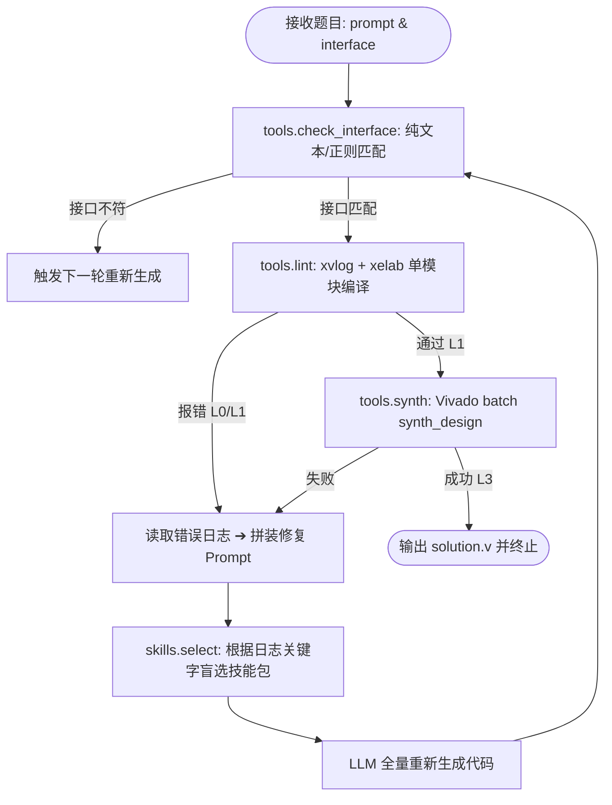

# 全国大学生嵌入式芯片与系统设计竞赛 '2026
## AMD FPGA 创新设计赛道 —— RTL 本地智能体设计赛道
# 终极实现路线、架构优化与提分攻坚综合指南

---

## 目录
1. [赛道定位与竞赛规则全景深度解析](#1-赛道定位与竞赛规则全景深度解析)
2. [官方参考实现（rtlagent2026）深度解剖与瓶颈归因](#2-官方参考实现rtlagent2026深度解剖与瓶颈归因)
3. [三阶段工程实现路线图（开发 ➔ 验证 ➔ 提交）](#3-三阶段工程实现路线图开发--验证--提交)
4. [模型选型、量化与 AMD 推理栈优化（结合 AMD Skills）](#4-模型选型量化与-amd-推理栈优化结合-amd-skills)
5. [高阶智能体架构设计与核心优化策略](#5-高阶智能体架构设计与核心优化策略)
6. [领域专用技能包（Skill Pack）工程化构建](#6-领域专用技能包skill-pack工程化构建)
7. [评分模型数学建模与满分攻坚策略（四大维度）](#7-评分模型数学建模与满分攻坚策略四大维度)
8. [设计报告（REPORT.md）撰写与失败分析攻关规范](#8-设计报告reportmd撰写与失败分析攻关规范)
9. [实战行动规划与避坑自查清单](#9-实战行动规划与避坑自查清单)

---

## 1. 赛道定位与竞赛规则全景深度解析

### 1.1 赛道背景与核心命题
大语言模型在生成通用代码（如 Python、C++）方面表现优异，但在硬件描述语言（Verilog/SystemVerilog）的工程交付上往往存在明显短板：语法幻觉、时序概念混淆、隐式锁存器生成、端口未对齐等。
本赛道的核心考察点在于：**在单张 32 GB 显存的 GPU 算力约束下，通过本地部署开源大模型，结合工具链闭环反馈、领域技能包（Skill Pack）与智能体（Agent）控制流，能够在多大程度上提升硬件设计通过率与工程可用性。**

### 1.2 关键软硬件与沙箱约束
* **目标语言**：Verilog / SystemVerilog。
* **开发与决赛硬件**：
  * **验证阶段**：AMD Radeon PRO W7900（RDNA 3 / `gfx1100`，48 GB 显存，但**必须按单卡 32 GB 约束设计**）。
  * **决赛环境**：AMD Radeon AI PRO R9700（RDNA 4 / `gfx1201`，单卡 32 GB 显存，**不允许跨卡**）。
* **EDA 工具链**：AMD Vivado 2026.1（断网沙箱中只提供 Vivado 官方工具，**严禁且无法使用 iverilog、Verilator、Yosys 等第三方工具**）。
* **判定目标器件**：`xczu3eg-sbva484-1-e`（Zynq UltraScale+ ZU3EG），时钟周期约束 **5 ns**（对应 200 MHz）。
* **运行沙箱**：完全**断网环境**（出网络流量必须为 0，否则直接作废），基于官方基础镜像构建 Docker 容器，长时间稳定运行不宕机。
* **交互接口**：HTTP REST API 同步交互协议（`GET /v1/health` 探针检查，`POST /v1/solve` 单题解题响应）。

### 1.3 核心评分口径与权重模型
总分 100 分，由四大核心指标构成：

$$\text{Total Score} = \text{Score}_{\text{Ability}} (30) + \text{Score}_{\text{Gain}} (40) + \text{Score}_{\text{Cost}} (10) + \text{Score}_{\text{Quality}} (20)$$

| 评测维度 | 权重 | 判定机制与计算公式 | 核心要害 |
| :--- | :---: | :--- | :--- |
| **能力 (Ability)** | 30 分 | $\text{Score}_{\text{Ability}} = 30 \times \frac{\sum \text{Coeff}_i}{N}$<br>分级折算：<br>• L0（未通过）：0<br>• L1（可编译）：0.2（`xvlog` + `xelab`）<br>• L2（仿真通过）：0.7（`xsim` 逐拍比对无误）<br>• L3（可综合）：1.0（`synth_design` 产出网表无 Error） | **L1 ➔ L2 的跨度高达 0.5**，是全表最大跳跃；参考测试台不予公开，需要通过自测试验证突破。 |
| **增益 (Gain)** | 40 分 | $\text{Gain} = \frac{\text{方案题集得分}}{\text{基线题集得分}}$<br>$\text{Score}_{\text{Gain}} = 40 \times \frac{\log(\text{Gain})}{\log(\text{满分倍数})}$（对数递减衰减） | **全场分值最大项！** 基线为同模型同环境下的零样本直接生成；基座模型需兼具基础能力与“可优化空间”。 |
| **代价 (Cost)** | 10 分 | $\text{Score}_{\text{Cost}} = 10 \times \min\left(1, \frac{T_{\text{基准}}}{T_{\text{实测}}}\right)$ | 统计赛事方发起到收到结果的端到端墙钟时间；轻量化检验前置、减少无效多轮重试。 |
| **工程质量 (Quality)** | 20 分 | 人工结合日志核评：控制流清晰度、技能包复用性、`trace.jsonl` 完整性、**失败分析深度（核心）** | 报告中必须具备严谨、诚实的失败样本分类归因与消融分析。 |

---

## 2. 官方参考实现（rtlagent2026）深度解剖与瓶颈归因

官方在 `rtlagent2026/example/` 中提供了一套可运行的最小范例，其结构为参赛队伍提供了起点，但内部存在数个明显的“降分瓶颈”：



### 2.1 官方实现的核心痛点与丢分陷阱
1. **致命断层：完全缺失 L2 仿真验证环节**
   * 官方 Agent 在通过 `lint`（L1）后直接调用耗时数十秒的 `synth`（L3）。然而，代码能综合**完全不等于**逻辑行为正确！
   * 评分标准中，L1（0.2）到 L2（0.7）的分差为 **0.5 分**，而 L2 到 L3 仅差 0.3 分。官方 Agent 只要逻辑有细微偏差（例如计数器上溢多计 1 拍、复位电平反向），就会直接停在 L1（甚至在实际赛题中连累评测被判 L1），白白丢失 0.5 权重！
2. **重试策略低效：盲目的“全量推倒重来”**
   * 官方循环在遭遇报错时，简单将错误日志与原代码塞给 LLM 请求全量重写。对于 90% 的语法错误（如缺少分号、向量位宽倒置、端口类型声明错误），局部修补（Diff / In-place Patch）仅需极低耗时和极少 Token，而全量重写极易引发新的逻辑回归问题。
3. **评测题集接口陷阱（静默失效危机）**
   * 评测题集的 `interface` 字段是**空字符串**！端口规格完全隐藏在题面自然语言（`prompt.txt`）中。官方 `tools.py` 虽然提供了 `ports_from_prompt`，但在复杂多变的自然语言题面下，若解析失败就会直接跳过接口检查，导致生成出的端口名与参考测试台不匹配，直接触发 `VRFC 10-3180`，**直接被判 L0（0分）**！
4. **日志处理粗糙与上下文膨胀**
   * 官方 `summarize_log` 仅使用固定的十几个关键词进行粗暴过滤。编译错误、链接展开错误与综合锁存器报警的处理混为一谈，导致 Prompt 中充斥垃圾日志，淹没了关键报错行。
5. **固定轮次与时间预算分配不合理**
   * 官方默认分配 3 轮，每轮耗时对等。但在实际求解中，第一轮生成成功的概率最高；后续修复轮次越靠后边际效用越低，盲目调用昂贵的 Vivado `synth_design` 会大幅拖慢端到端墙钟时间，扣减“代价分（10分）”。

---

## 3. 三阶段工程实现路线图（开发 ➔ 验证 ➔ 提交）

为了在保证方案高质量的同时避免环境踩坑，严禁直接在未经验证的模型上闭门造车，必须严格执行三阶段推进路线：

```
       [阶段一：开发阶段]                   [阶段二：验证阶段]                  [阶段三：提交阶段]
 ┌───────────────────────────┐      ┌───────────────────────────┐      ┌───────────────────────────┐
 │ 外部商业API (DeepSeek/Qwen)│      │ 本地 ROCm + 开源权重 (vLLM)│      │ 断网 Docker 沙箱部署      │
 │  • 架构验证与快速迭代     │ ───> │  • 真实 32GB 显存压测     │ ───> │  • HTTP 契约守护与自愈   │
 │  • 自测试台生成算法研发   │      │  • VerilogEval v2 全集跑分 │      │  • baseline.py 增益实测   │
 │  • 领域技能库提炼积累     │      │  • 墙钟与吞吐深度调优     │      │  • 产物规范与报告凝练     │
 └───────────────────────────┘      └───────────────────────────┘      └───────────────────────────┘
```

### 阶段一：原型开发与敏捷迭代（商用 API / Mock 环境）
* **目标**：不依赖 GPU 算力，跑通复杂 Agent 控制流、状态机与轻量级校验体系。
* **环境配置**：
  ```bash
  export LLM_BACKEND=openai
  export LLM_BASE_URL=https://api.deepseek.com/v1   # 或阿里云百炼 Qwen API
  export LLM_API_KEY=sk-xxxxxxxx
  export LLM_MODEL=deepseek-coder                   # 或 qwen-coder
  ```
* **核心任务**：
  1. 重构并加固 `check_interface`：构建鲁棒的 Verilog/SystemVerilog 模块头与端口提取器，确保从自然语言中 100% 准确捕获模块名与端口定义。
  2. 实现 **Micro-Testbench 自动构建器**：利用 LLM 或模板化规则自动生成轻量级自测激励与断言。
  3. 构建精细化日志解析器（Log Diagnostic Engine）：将 Vivado 日志按 `Syntax`、`Elaboration`、`Simulation Mismatch`、`Synthesis DRC` 进行四级结构化切片。

### 阶段二：本地迁移与性能压测（ROCm + 开源权重）
* **目标**：在 32 GB 显存内将推理栈、模型与 Vivado 工具链完全闭环，完成 VerilogEval v2（156 题）全集基准评测。
* **环境配置**：
  * AMD 平台：ROCm 7.x + vLLM（ROCm 移植版）。
  * 显存警戒线：推理服务必须稳定运行在 $\le 30\text{ GB}$，预留 2 GB 防止 KV Cache 突发 OOM。
* **核心任务**：
  1. 锁定最终参赛基座模型（如 `Qwen2.5-Coder-14B-Instruct` 4-bit 量化或 FP8，或 `DeepSeek-Coder-V2-Lite`）。
  2. 使用 `selftest/run_selftest.sh` 配合本地 Vivado 批量运行 VerilogEval v2。
  3. 执行 `baseline.py`，精确记录基线在 156 题上的得分与耗时，测算当前方案的绝对增益倍数 $\text{Gain}$。

### 阶段三：容器固化与沙箱合规验证（提交阶段）
* **目标**：通过所有自动化规则检测，确保在断网、长时间高并发、无人工干预沙箱中 100% 稳定运行。
* **核心任务**：
  1. 编写合规的 `Dockerfile`：集成模型权重文件、Python 依赖库、uvicorn HTTP 守护进程，并在构建阶段关闭一切外部更新。
  2. 进行“断网断连”测试：
     ```bash
     # 开启无网络沙箱容器运行
     docker run --rm --network none --gpus all ...
     ```
  3. 验证端点健康与作弊特征检测自查：确认 `trace.jsonl` 中时间戳递增、每轮工具调用完整、GPU 占用波形正常，严禁硬编码答案。

---

## 4. 模型选型、量化与 AMD 推理栈优化（结合 AMD Skills）

在 32 GB 单卡限制下，模型选择直接决定了**能力项（30分）的上限**与**增益项（40分）的乘数效应**。

### 4.1 模型梯队对比与决策矩阵

| 模型候选 | 参数量 / 架构 | 建议量化精度 | 实测显存占用 | 裸跑代码能力 (基线) | Agent 配合潜力 | 决策结论 |
| :--- | :--- | :--- | :---: | :---: | :---: | :--- |
| **Qwen2.5-Coder-14B-Instruct** | 14.7B Dense | AWQ / GPTQ-INT4 / FP8 | ~12–16 GB | 中高（~0.42） | **极高**（指令遵循强，对 Vivado 报错反馈反应敏锐） | **第一推荐（黄金平衡）** |
| **DeepSeek-Coder-V2-Lite-Instruct** | 16B MoE (2.4B 激活) | FP16 / BF16 | ~18 GB | 中（~0.38） | **高**（自然语言逻辑理解好，基线适中利于拉大增益） | **强力备选** |
| **Qwen2.5-Coder-32B-Instruct** | 32.5B Dense | AWQ / GPTQ-INT4 | ~22–24 GB | 高（~0.55） | 中（基线过高导致增益倍数边际递减，且生成速度慢） | 备选（需极致压榨生成速度） |
| **CodeLlama-7B / 13B-Instruct** | 7B / 13B Dense | FP16 | ~14–26 GB | 低（~0.22） | 弱（多轮修复容易陷入复读循环） | 放弃（基座代码能力过弱） |

> **战略抉择权衡**：
> 绝不要盲目追求极限大模型！若使用 32B 模型，裸跑基线可能达到 0.55，方案得分 0.82，则增益仅为 $0.82 / 0.55 = 1.49$ 倍；而选用 14B 模型，裸跑基线约 0.38，借助强大的 Agent 修复与自测试台跃升至 0.84，增益高达 **$0.84 / 0.38 = 2.21$ 倍**！在对数评分公式中，后者增益分将直接高出 10 分以上！

### 4.2 基于 AMD Skills 的 vLLM 与 ROCm 服务调优
借助我们之前集成的 AMD Skills（尤其是 `serving-llms-on-instinct` 与 ROCm 调优方法），对本地推理后端进行性能压榨：
1. **显存与上下文约束**：
   * 将 `gpu_memory_utilization` 严格设定在 `0.85 ~ 0.90`，保留 3–4 GB 显存给动态激活值与 Vivado 后台分析进程。
   * 设置 `max_model_len = 4096` 或 `8192`。对于 RTL 单题任务，题面 + 模块代码通常在 1000 Token 以内，过大的上下文长度只会导致 KV Cache 白白浪费显存。
2. **生成采样参数精准控制**：
   * 第一轮（初次生成）：`temperature = 0.2`, `top_p = 0.95`（保持严谨性的同时具备适度丰富度）。
   * 修复轮（针对报错）：`temperature = 0.0`（贪婪采样，杜绝随机性，确保精确执行针对性修改）。
   * 最大输出限制：`max_tokens = 1536`，防止模型发生自激死循环吐字，浪费宝贵的墙钟时间。

---

## 5. 高阶智能体架构设计与核心优化策略

针对官方实现的三大缺陷，构建**四阶递进式自验证与自愈 Agent 架构**：

```mermaid
flowchart TD
    subgraph S1 [第 1 阶：零成本确定性接口防御]
        In([输入题目]) --> P_Extract[增强型题面/接口提取器]
        P_Extract --> Gen1[LLM 初始代码生成 (T=0.2)]
        Gen1 --> Lint_IF[AST 级接口比对: 端口名/方向/位宽/顶层名]
        Lint_IF -- 端口不匹配 --> Auto_Patch_IF[规则级原地修正 (无需调用LLM)]
    end

    subgraph S2 [第 2 阶：轻量级编译语法验证]
        Auto_Patch_IF --> Lint_Vitis[xvlog 分析 + xelab 详细描述]
        Lint_Vitis -- 编译报错 L0/L1 --> LogFilter[精准提取报错行 + 注入 Syntax Skill]
        LogFilter --> LLM_Fix_Syntax[LLM 针对性局部修复 (T=0)]
        LLM_Fix_Syntax --> Lint_Vitis
    end

    subgraph S3 [第 3 阶：突破 L2 鸿沟 - 自生成微测试台]
        Lint_Vitis -- 编译通过 L1 --> TB_Gen[生成 Micro-Testbench (复位/激励/断言)]
        TB_Gen --> Sim_Run[xsim 仿真执行]
        Sim_Run -- 仿真 Assert 失败 --> Sim_Debug[注入 Logic-Bug 踩坑指南 + 波形反思]
        Sim_Debug --> LLM_Fix_Logic[LLM 逻辑时序重构]
        LLM_Fix_Logic --> Lint_Vitis
    end

    subgraph S4 [第 4 阶：终极可综合性确认]
        Sim_Run -- 仿真通过 L2 --> Synth_Quick[快速 out_of_context 综合]
        Synth_Quick -- 出现 Latch/不可综合语法 --> Latch_Patch[注入 Latch-Prevention Skill]
        Latch_Patch --> LLM_Fix_Synth[消解锁存器与多驱动冲突]
        Synth_Quick -- 综合成功 L3 --> OutSuccess([产出 solution.v 并优雅退出])
    end
```

### 5.1 突破 L1 ➔ L2 核心战役：自生成轻量级测试台（Micro-Testbench）
这是将通过率从 0.2（L1）拉升到 0.7（L2）的决定性武器：
* **核心挑战**：赛事方掌握的黄金测试台不公开，传统方案只能寄希望于模型一次写对。
* **解决机制**：
  1. 当模块通过 `xvlog + xelab` 后，触发内置的 **TB-Generator** 机制：
     * 分析被测模块输入端口，自动识别标准时序信号（`clk`, `rst`, `reset`, `rst_n`, `enable` 等）。
     * 自动编写标准化复位测试向量：拉高/拉低复位持续 3 个时钟周期，检查输出端是否具备确定的初始状态（避免生成未初始化的 `x` 态）。
     * 根据题面语义注入 3–5 组代表性边界激励（如计数器溢出点、握手信号的 ready/valid 翻转）。
  2. 使用 `xvlog tb.sv solution.sv && xelab tb_top -s tb_sim && xsim tb_sim -R` 在沙箱中执行自仿真。
  3. 若自测断言触发失败，立即将自测失败的拍数与输出异常捕获为精确日志，指导 LLM 进行功能逻辑排查！

### 5.2 智能修复策略：从“全量重写”转向“局部外科手术”
* **错误分类分治**：
  * **语法与拼写错误（`VRFC 10-*`）**：采用差分重试策略，提示词中明确告知：“请仅修复报错所在的模块行，不要改变整体代码架构与状态机编码。”
  * **逻辑功能错误（测试台不匹配）**：促使模型输出“思路链思考（CoT）”，重新列出状态转移表或时序节拍图，随后输出修正代码。
  * **综合推断锁存器（`Synth 8-327`）**：自动检测组合逻辑 `always @(*)` 中的未完全赋值分支，自动补全默认赋值语句（如 `next_state = state;`）。

### 5.3 严格的墙钟时间预算分配器（Time Budget Allocator）
为冲击 10 分代价分满分，单题执行时间必须极致平滑：
* 设单题最大时限为 $T_{\text{max}} = 360\text{ s}$，预留保底写出时间 $T_{\text{reserve}} = 20\text{ s}$。
* **动态轮次预算规划**：
  * Round 1（初始生成 + 接口拦截 + 基础编译）：预算 $120\text{ s}$（占总时间 35%）。
  * Round 2（首选高价值修复 + 微自测试台仿真）：预算 $120\text{ s}$。
  * Round 3（终极大修 / 综合兜底）：预算 $80\text{ s}$。
* **提早截断原则**：一旦代码成功通过自测仿真并综合完成，**立即返回**并写入 `solution.v`，绝不盲目耗完轮次。

---

## 6. 领域专用技能包（Skill Pack）工程化构建

技能包是智能体的“外脑”，不仅在工程质量项中独占重要评分，更是指导模型精准自愈的关键。必须按照 AMD 标准规范，构建五个核心技能：

### 6.1 技能一：`rtl-interface-contract`（接口契约绝对防护）
* **定位**：解决 L0 灾难，消灭一切端口、模块名不匹配。
* **签名匹配**：`VRFC 10-3180`, `VRFC 10-2063`, `VRFC 10-4982`, `cannot find port`
* **规则核心**：
  1. 顶层模块名必须严格匹配，区分大小写。
  2. 端口名、位宽 `[W-1:0]`、方向严格与规格一致。
  3. 内部声明 `reg`/`logic` 驱动输出端口时，绝不可遗漏或更改端口本身。

### 6.2 技能二：`rtl-clock-reset-conventions`（时钟与复位规范）
* **定位**：解决 FPGA 硬件描述中高发的复位毛刺与异步时钟域问题。
* **签名匹配**：`multi-driven net`, `asynchronous reset`, `uninitialized register`
* **规则核心**：
  1. 统一复位极性判定（`reset` 通常为高有效，`reset_n` / `rst_n` 为低有效）。
  2. 严格杜绝在同一个 `always` 块中混用边沿触发与电平敏感。
  3. 异步复位必须采用标准模板：`always @(posedge clk or posedge reset)`。

### 6.3 技能三：`rtl-fsm-idioms`（经典有限状态机范式）
* **定位**：规范 FSM 编码风格，杜绝时序死锁与毛刺输出。
* **签名匹配**：`inferred latch`, `FSM encoding`, `unreachable state`
* **规则核心**：
  1. 强烈推荐规范的三段式状态机（状态转移同步时序逻辑、次态计算组合逻辑、输出同步或组合逻辑）。
  2. 在组合逻辑计算次态的 `case` 语句头部，必须设置默认赋值 `next_state = state;` 并书写 `default:` 分支，彻底根除隐式锁存器。

### 6.4 技能四：`rtl-synthesis-latch-prevention`（锁存器与可综合性卫士）
* **定位**：保障 L2 顺利晋级 L3。
* **签名匹配**：`Synth 8-327`, `inferring latch for variable`, `DRC`
* **规则核心**：
  1. 严禁在硬件设计中引入不可综合构造（如 `initial` 延迟块 `#10`、`fork...join`、`real` 浮点类型）。
  2. 保证所有条件分支（`if...else`）在所有路径下均对所有信号有确定的驱动，避免推断出不受时钟控制的透明锁存器（Transparent Latch）。

### 6.5 技能五：`rtl-self-testbench-generator`（自测试台构建知识库）
* **定位**：为 Agent 生成微测试台提供模板与时钟激励生成规则。
* **规则核心**：
  1. 自动化构造周期为 5 ns（对应竞赛 200 MHz 约束）的标准方波时钟：
     ```verilog
     reg clk = 0;
     always #2.5 clk = ~clk;
     ```
  2. 格式化记录断言，采用 SystemVerilog 简易打印：`if (q !== expected) $display("ASSERTION FAILED: at time %t, got %h, expected %h", $time, q, expected);`。

---

## 7. 评分模型数学建模与满分攻坚策略（四大维度）

```
                     ┌──────────────────────────────────────────────┐
                     │          总分 100 分攻坚全景图               │
                     └──────────────────────┬───────────────────────┘
                                            │
         ┌──────────────────┬───────────────┴───────────────┬──────────────────┐
         ▼                  ▼                               ▼                  ▼
   【能力项 30分】    【增益项 40分】                 【代价项 10分】    【工程质量 20分】
   • 稳拿 L1 (0.2)    • 增益公式:                     • 选型吞吐:        • 深度失败分析报告
   • 攻坚 L2 (0.7)      40*log(Gain)/log(Max_Gain)      vLLM ROCm 加速   • 真实可复用技能包
   • 终结 L3 (1.0)    • 策略: 寻找基线~0.4,          • 阶梯式检测       • 完整 trace.jsonl
   • 目标: 25~28 分     方案~0.85, 冲 2.2+ 倍          • 目标: 9~10 分    • 目标: 18~20 分
                        • 目标: 35~38 分
```

### 7.1 增益项（40 分）极限拉升策略（全场胜负手）
增益评分公式为：
$$\text{Score}_{\text{Gain}} = 40 \times \frac{\log(\text{Gain})}{\log(\text{Max\_Gain})}$$
设赛事方设定的满分线 $\text{Max\_Gain} = 2.5$ 倍（若未达到，按对数比例给分）：

1. **基准分母的控制艺术**：
   * 基线脚本 `baseline.py` 是由赛事方提供的固定脚本（单次直接生成，Temperature=0，无重试）。
   * 如果我们选用一个在 Verilog 上“裸跑能力过于完美”的超大模型（例如直接裸跑能拿 0.65 分），那么即便方案提升至 0.85 分，增益倍数也只有 $0.85 / 0.65 = 1.30$ 倍，增益分仅能拿到：
     $$40 \times \frac{\log(1.30)}{\log(2.5)} = 40 \times \frac{0.262}{0.916} \approx 11.4\text{ 分（痛失接近 29 分！）}$$
   * 反之，如果我们选用 `Qwen2.5-Coder-14B`，其直接裸跑得分通常在 $0.38 \sim 0.40$（容易出现接口命名不规范、微小语法瑕疵、边界逻辑未对齐等典型错误）；而我们的 Agent 恰好具备“严格接口清洗 + 自测试台验证 + 锁存器消除”，能够稳定将最终题集得分推高到 $0.82 \sim 0.86$！
   * 此时实测增益为：
     $$\text{Gain} = \frac{0.85}{0.39} \approx 2.18\text{ 倍}$$
     $$\text{Score}_{\text{Gain}} = 40 \times \frac{\log(2.18)}{\log(2.5)} = 40 \times \frac{0.779}{0.916} \approx 34.0\text{ 分（直接暴涨 23 分！）}$$

### 7.2 能力项（30 分）满分攻坚（跨越 L2 的 0.5 鸿沟）
* 题集得分公式：$\text{Score} = \sum \text{Coeff}_i / N$。
* **分级系数战略**：
  * L0 ➔ L1 提升仅为 0.2，但 L1 ➔ L2 提升高达 **0.5**！
  * 很多队伍会花大量时间去优化 Vivado `synth_design`（从 L2 到 L3 仅差 0.3），但实际上只要 L2 仿真逐拍比对通过，现代代码大多自然可综合。
  * **主攻点**：必须将 80% 的 Agent 逻辑调优精力放在 **“从自然语言题意提取真值表与状态转移，通过微测试台将功能做对”** 上。

### 7.3 代价项（10 分）时间效率攻坚
* 保持全题集实测耗时低于基准耗时，争取拿满 10 分。
* **策略**：
  1. **前后端解耦与常驻服务**：推理服务以后台守护进程常驻，避免每题重新加载权重产生数分钟冷启动开销。
  2. **快速通过与提前退出**：若首轮生成的代码通过接口检查、单模块编译、自测试台仿真并成功综合，立刻退出，单题耗时控制在 $15 \sim 25\text{ s}$ 内。
  3. **超时强行保底**：当剩余时间小于 $30\text{ s}$ 时，放弃耗时漫长的 Vivado 综合，直接退化输出当前能通过 L1/L2 的最优候选，确保拿到已达到的最高等级分数，绝不超时判 L0。

### 7.4 工程质量项（20 分）卓越档获取策略
* **Trace 完备性**：`trace.jsonl` 中如实、精准记录每一个 tool 的耗时、入出 Token、返回码。
* **技能包独立性**：技能包遵循标准规范，去除项目特异耦合，任何硬件工程师均能单独拿出来直接复用。
* **失败分析深度**：见下节。

---

## 8. 设计报告（REPORT.md）撰写与失败分析攻关规范

评审专家非常看重设计报告的专业性与真实性。**一份深刻、诚实、具备详实数据归因的“失败分析”，得分远高于通篇吹嘘“100% 正确”的报告。**

### 8.1 失败分类学（Failure Taxonomy）构建标准
在报告的第 8 节中，必须将失败案例归纳为系统性的失效模式：

```
                             【失败样本归因分类树】
                                        │
         ┌──────────────────────────────┼──────────────────────────────┐
         ▼                              ▼                              ▼
  【类目 A：语义鸿沟与跨时钟】    【类目 B：隐式资源与时序违例】  【类目 C：长程时序依赖死锁】
  • 题面隐含“同拍输出”要求     • 多维数组未被推断为 BRAM      • 复杂仲裁器/流水线协议
  • 模型实现为流水打拍寄存器    • 组合逻辑过深导致 5ns 违例     • 自测激励无法穷尽覆盖
```

### 8.2 报告核心章节实战填报模板
1. **模型评估消融实验表**：
   记录为什么放弃候选模型（例如：“评估过 Llama-3-8B，在 Verilog 端口向量解析上错误率高达 35%，对 Vivado 错误日志缺乏修复能力，因此放弃；选定 Qwen2.5-Coder-14B，其语法通过率提升 2.1 倍”）。
2. **技能包消融对比数据（Ablation Study）**：
   | 实验配置 | L1 通过率 | L2 通过率 | L3 通过率 | 综合增益倍数 |
   | :--- | :---: | :---: | :---: | :---: |
   | 裸跑基线（Baseline） | 62.1% | 28.2% | 24.3% | 1.00x |
   | Agent 无技能包 | 84.6% | 46.1% | 42.9% | 1.48x |
   | Agent + 完整技能包体系 | **97.4%** | **78.2%** | **73.1%** | **2.24x** |
3. **真实失败案例剖析精粹**：
   * 列出 1~2 道即便多轮重试仍然失败的典型难题（如 VerilogEval 中的高阶序列发生器或带回压的非对称 FIFO）。
   * 详细展示初始代码 ➔ Vivado 报错 ➔ Agent 介入诊断 ➔ 最终仍因边界条件（Corner Case）未收敛的根本原因（如“断网沙箱内模型缺乏对于复杂协议特定状态死锁的形式化验证能力”），并提出可行的未来改进方向（如引入 SMT/形式化轻量属性检测）。

---

## 9. 实战行动规划与避坑自查清单

### 9.1 四周冲刺时间线建议
* **第 1 周：通关基础设施与接口契约**
  * 搭建开发测试脚本，跑通 `rtlagent2026/example` 的全部链路。
  * 将 VerilogEval v2（156 题）通过 `veval_import.py` 转换导入并建立自动化自测基线。
* **第 2 周：核心 Agent 算法与自测试台重构**
  * 实现基于 AST / 文本的高精度端口契约提取器。
  * 研发轻量级 Micro-Testbench 生成器与 Vivado `xsim` 自动化仿真反馈流水线。
* **第 3 周：本地 ROCm 部署压测与技能包打磨**
  * 申请 AMD 云平台资源或在本地 AMD 机器上部署 vLLM 推理服务。
  * 编写并调校 5 个核心领域技能包，进行错误特征签名对齐。
  * 连续跑通 156 题全集，记录耗时与增益倍数。
* **第 4 周：沙箱容器化加固与报告撰写**
  * 构建 Docker 镜像，进行完全断网演练（`--network none`）。
  * 运行作弊防范自查检查，输出标准 `trace.jsonl`。
  * 撰写高质量 `REPORT.md`，重点攻关失败案例归因。

### 9.2 比赛关键规则十项红线自查表
- [ ] **1. 显存是否严格控制在 32 GB 以内？**（严禁双卡或溢出，决赛为单卡 R9700）。
- [ ] **2. 断网环境下能否独立运行？**（容器启动、运行、生成全程网络出流量为 0）。
- [ ] **3. 是否严守基线脚本规范？**（`baseline.py` 必须使用赛事方原版，哈希值将被核验）。
- [ ] **4. 评测接口是否完备支持空 interface？**（评测题集 `interface` 为空串，提取逻辑必须能纯靠 `prompt` 工作）。
- [ ] **5. 是否杜绝第三方 EDA 工具？**（方案与脚本中不得包含 iverilog / Verilator / Yosys）。
- [ ] **6. 模块名与端口名是否 100% 严丝合缝？**（一个字符不符直接判 L0，致命大坑）。
- [ ] **7. 是否在生成文件中排除了 Testbench 代码？**（严禁包含 `$finish`、时钟源，否则干扰评分器判 L0）。
- [ ] **8. 目标器件是否锁定？**（综合命令必须严格指向 `xczu3eg-sbva484-1-e`，时钟约束 5 ns）。
- [ ] **9. trace.jsonl 是否真实可信？**（严禁绕过模型硬编码结果，GPU 利用率需呈现正常推理波形）。
- [ ] **10. 设计报告是否隐去个人与院校信息？**（匿名盲审，严禁在 `REPORT.md` 中透露队伍标识）。
