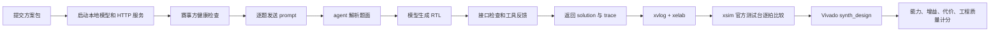

# RTL 本地智能体比赛评测流程

本文整理 AMD RTL/HLS 本地智能体设计赛道中 RTL track 的评测流程，重点说明从赛事方发送题面，到 agent 返回 RTL，再到 Vivado 判定和最终计分的完整链路。

本文依据以下材料整理：

- [AMD 选题指南](./AMD.pdf)
- [RTL track README](./rtlagent2026/README.md)
- [评分细则](./rtlagent2026/SCORING.md)
- [接口契约](./rtlagent2026/docs/API_CONTRACT.md)
- [本地自测说明](./rtlagent2026/selftest/README.md)

具体评测窗口、正式题量、单题时间预算、全题集时间预算和增益满分线，以赛前最终公告为准。

## 总体流程

正式评测不是把完整题库一次性提供给 agent，而是由赛事方逐题通过 HTTP 接口投递题面。服务返回 RTL 后，赛事方使用自己的官方测试台、参考实现和 AMD Vivado 进行分级判定。



## 1. 提交物和运行约束

方案需要包含：

- 可本地部署的开源模型；
- 推理后端及服务配置；
- agent 源码；
- skill 技能包；
- `run.sh` 单题入口；
- `run_baseline.sh` 基线入口；
- `MODEL.md`、`REPORT.md`、Dockerfile 等复现材料。

模型必须在单张 32 GB 显存内运行，正式环境断网，不能依赖在线 API 或临时下载。提交后，评测窗口内不能修改 agent、skill 或模型权重，提交材料的哈希需要保持一致。

评分细则禁止联网检索、预置答案和绕过模型。接口解析、语法检查、日志分析和格式修复可以由脚本完成，但脚本不能直接根据题目模式生成答案而让模型只进行形式上的调用。

## 2. 服务启动和健康检查

赛事方先调用：

```http
GET /v1/health
Authorization: Bearer <token>
```

服务需要返回类似：

```json
{
  "ready": true,
  "track": "rtl",
  "model": "模型名称",
  "vram_gb": 21.4
}
```

`track` 必须是 `rtl`，`model` 应与 `MODEL.md` 一致，`ready` 表示模型和 agent 已经可以处理题目。

服务应绑定 `127.0.0.1`，再由平台的 tunnel 对外暴露。推理服务端口只供本机 agent 使用，不应单独暴露到公网。

## 3. 赛事方发送的题目

正式投题接口是：

```http
POST /v1/solve
Authorization: Bearer <token>
Content-Type: application/json
```

请求结构类似：

```json
{
  "task_id": "eval-0007",
  "nonce": "T042-eval-0007-3-1763251200123456789",
  "mode": "agent",
  "prompt": "实现一个模块 TopModule，在串行输入位流中检测序列 1101 ...",
  "interface": "",
  "deadline_s": 360
}
```

字段含义：

| 字段 | 含义 |
| --- | --- |
| `task_id` | 题目标识，响应时原样返回 |
| `nonce` | 当前请求的一次性标识 |
| `mode` | `agent` 使用完整方案，`baseline` 绕过 agent 和 skill |
| `prompt` | RTL 题面 |
| `interface` | 接口字段；正式 RTL 题通常为空字符串 |
| `deadline_s` | 当前题目的单题时间上限 |

正式 RTL 题中，模块名、端口名、方向和位宽写在自然语言 `prompt` 内，例如：

```text
I would like you to implement a module named TopModule ...

- input clk
- input d (8 bits)
- output q (8 bits)
```

因此 agent 不能只依赖 `interface.txt`，必须能够从题面提取模块接口。当前仓库的示例题和评测题采用同样的题面形态。

## 4. agent 内部执行

典型执行路径如下：

```text
serve_api.py
  -> 临时目录/prompt.txt 和 interface.txt
  -> run.sh
  -> agent.main
  -> HardwareSpec 解析
  -> skill 选择
  -> 模型生成 RTL
  -> 接口检查、编译、仿真、综合
  -> 必要时根据工具反馈修复
  -> solution.v 和 trace.jsonl
```

响应结构类似：

```json
{
  "task_id": "eval-0007",
  "solution": "module TopModule (...);\n  ...\nendmodule\n",
  "trace": "{\"tool\":\"llm\",...}\n{...}\n",
  "elapsed_s": 214.3
}
```

其中：

- `solution` 是生成的 Verilog/SystemVerilog；
- 做不出来时应返回空字符串，而不是让服务异常退出；
- `trace` 是 JSONL，每一行记录一次模型调用或工具调用；
- `elapsed_s` 仅用于交叉核对，最终计时以赛事方观察到的请求墙钟时间为准。

trace 可以记录如下信息：

```json
{"tool":"llm","tokens_in":2841,"tokens_out":512}
{"tool":"lint","rc":1,"excerpt":"cannot find port q"}
{"tool":"synth","rc":0,"excerpt":"Synthesis finished with 0 errors"}
```

trace 用于工程质量评分、失败分析和生成结果与工具调用的一致性检查。

## 5. 超时和服务失败

当前接口契约规定：

- 赛事方从发出请求开始计时，到收到响应结束；
- 赛事方侧超时约为 `deadline_s + 20` 秒；
- agent 应在自己的 deadline 到达前返回当前最佳结果；
- 超时、连接断开、返回格式错误都按 L0；
- 赛事方不会因为单题失败自动重投；
- 服务需要连续处理数百次请求，中途不得重启。

`deadline_s=360` 是接口示例，不代表最终固定预算。

## 6. 官方 RTL 判定

赛事方使用官方参考测试台和参考实现，不使用参赛者自定义测试台作为最终判定依据。判定在 AMD Vivado 中逐级进行：

| 级别 | 判定内容 | 系数 |
| --- | --- | ---: |
| L0 | 服务失败、接口错误、编译失败等 | 0 |
| L1 | `xvlog` 分析和 `xelab` 详细描述通过 | 0.2 |
| L2 | `xsim` 运行官方测试台，与参考实现逐拍比较且无 mismatch | 0.7 |
| L3 | `synth_design` 在目标器件上综合成功且无错误 | 1.0 |

判定是递进的：

```text
xvlog + xelab -> L1 可编译
             -> xsim 官方测试台 -> L2 仿真通过
             -> synth_design     -> L3 可综合
```

目标器件为：

```text
xczu3eg-sbva484-1-e
```

时钟约束为 5 ns。当前规则的 RTL 末级是综合成功，不要求继续完成布局布线、bitstream 生成或上板运行。

## 7. 多次采样和能力得分

每道题会进行多次独立生成。当前仓库的 selftest 定义为：

- `pass@1`：每题多个样本的系数取均值，再对题目求平均，参与正式计分；
- `pass@5`：每题取最好的一次，只作为稳定性诊断；
- 题集得分：

```text
题集得分 = 所有题目系数之和 / 题目数量
能力得分 = 30 × 题集得分
```

正式题集赛前不公开。VerilogEval v2 的 `dataset_spec-to-rtl` 适合开发阶段自测，但其结果不能直接当成正式成绩预测。

## 8. 基线和增益得分

赛事方会使用相同模型、相同量化、相同推理服务和相同上下文配置运行基线：

```text
题面 -> 模型直接生成 -> 不使用 agent、skill、工具，不重试
```

基线和完整方案必须在同一次运行中产生。基线不是更换一个弱模型，而是测量同一模型在没有 agent/skill 加持时的结果。

增益为：

```text
增益 = agent 题集得分 / baseline 题集得分
```

当前评分细则给出的增益公式是：

```text
增益得分 = 40 × log(增益) / log(满分线倍数)
```

结果上限为 40 分，满分线倍数由赛前公告确定。

## 9. 代价和工程质量

代价占 10 分，按完整题集的实际墙钟时间计算：

```text
代价得分 = 10 × min(基准总时长 / 实际总时长, 1)
```

工程质量占 20 分，主要考察：

- agent 控制流是否清晰；
- 重试和回退策略是否合理；
- skill 是否可复用；
- `trace.jsonl` 是否完整；
- 文档能否复现方案；
- 是否有真实、具体的失败分析。

## 10. 版本差异和开发注意事项

`AMD.pdf` 的早期选题指南写的是 Vivado/Vitis 2025.2；当前 `rtlagent2026` 的 README、评分细则和接口契约写的是 Vivado 2026.1。因此开发时应以当前仓库契约和赛前最终技术公告为准，不要把 PDF 中旧版本的目录路径直接写死。

对当前 agent 最重要的检查点是：

1. 能处理 `interface` 为空、端口写在自然语言题面中的情况；
2. 能在 deadline 内返回 `solution` 和 `trace`；
3. baseline 使用同一模型服务，但完全绕过 agent、skill 和工具；
4. trace 能证明模型确实参与了 RTL 生成；
5. 确定性脚本只做解析、检查和修复，不直接预置题目答案；
6. 必须在装有 Vivado 的环境中验证 L1、L2、L3，mock 测试不能代替真实成绩。

大赛官网公开的是报名、作品准备、分赛区评审和全国总决赛等总流程；RTL 技术赛道的具体评测窗口、题量和预算仍以赛前技术公告为准：<https://test.fpgachina.cn/home>。

